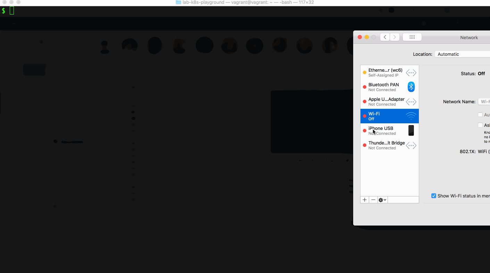

# The All-in-One Kubernetes Playground Usage Guide

This guide will work you through the steps to launch the All-in-One Kubernetes Playground with a mult-node cluster on a single machine!

## How to launch the playground?

Let's first clone the repository and go into its root directory:
```shell
$ git https://github.com/morningspace/lab-k8s-playground.git
```

When you have [Vagrant](https://www.vagrantup.com/) and its provider e.g. [VirtualBox](https://www.virtualbox.org/) installed, to launch the playground is quite easy, just run below command:
```shell
$ vagrant up
```

By default, it will provision the box and launch a three-node Kubernetes cluster.

You can also launch the playground on your host directly by running below command in repository root directory to initialize the environment at first:
```shell
$ ./install/launch.sh init
```

It will modify `.bashrc` in user home directory. Please re-login from terminal to reload `.bashrc` in a new user session, or run below command to reload it in current session:
```shell
$ . ~/.bashrc
```

Before reload, there are some environment variables defined in `.bashrc` that you can change to customize the playground to be launched, or you can leave as is so that default value will be used:
```shell
# The IP of your host, default is 127.0.0.1
export HOST_IP=
# The Kubernetes version, default is v1.14
export K8S_VERSION=
# The number of worker nodes, default is 2
export NUM_NODES=
```

Finally, let's run below command to launch the cluster:
```shell
$ launch default
```

Here, we use `launch` instead of `launch.sh`. After reload `.bashrc`, you can run `launch` anywhere. It doesn't have to be the repository root directory.

## How to access the playground?

If you launch the playground on your host, you can talk to the cluster directly. If it's inside the box, then you can run below command to login to the box from terminal:
```shell
$ vagrant ssh
```

You can also login using web terminal. To access it, use the host IP or the box IP that launches the playground, e.g. the default box IP is `192.168.56.100`, so the web terminal URL is https://192.168.56.100:4200. Please refer to ["Customize the playground"](#customize-the-playground) on how to change the box IP.

After login, you can use [kubectl](https://kubernetes.io/docs/reference/kubectl) to access the cluster, use [helm](https://helm.sh) to deploy applications, or other pre-installed tools, e.g. [kubens](https://github.com/ahmetb/kubectx), [kubectl aliases](https://github.com/ahmetb/kubectl-aliases) to make your access to the cluster much easier. Here is a demo that run variant command line tools from both normal and web terminals.


If you launch the playground inside the box, when you finish the work and want to swith to other context, you can run below command to suspend the box:
```shell
$ vagrant suspend
```

Next time when you go back to the box, run below command to resume it:
```shell
$ vagrant resume
```

You can also destroy the box if it's not needed anymore:
```shell
$ vagrant destroy
```

## What else can I do with the playground?

You can adjust the playground after it is launched using the Launch Utility, i.e. the `launch` command that you have already used in previous sessions.

Usually, the command is followed by a few targets separated by space. It then launches the targets in order of appearance one by one, e.g. this is going to launch `kubernetes`, then `helm`:
```shell
$ launch kubernetes helm
```

Actually, the [Vagrantfile](/Vagrantfile) also consistently uses `launch` to provision the box. There are a whole bunch of pre-defined targets available. You can even add your own. Please refer to ["Launch Utility Usage Guide"](Launch-Utility-Usage-Guide.md) for more details.

As an example, we will use `launch` to install [Istio](https://istio.io) and its demo application [Bookinfo](https://istio.io/docs/examples/bookinfo). Let's start from Istio:
```
$ launch istio
```

Wait for a while till it's finished. Then istio-bookinfo:
```shell
$ launch istio-bookinfo
```

When Istio and Bookinfo are all up and running, you can run below command to expose their ports so that can be accessed outside the cluster, e.g. in web browser:
```shell
$ launch istio::portforward istio-bookinfo::portforward 
Targets to be launched: [istio::portforward istio-bookinfo::portforward]
####################################
# Launch target istio...
####################################
» Forwarding service/grafana 3000:3000...
Done. Please check /home/vagrant/lab-k8s-playground/install/logs/pfwd-grafana.log
» Forwarding service/kiali 20001:20001...
Done. Please check /home/vagrant/lab-k8s-playground/install/logs/pfwd-kiali.log
» Forwarding pod/jaeger 15032:16686...
Done. Please check /home/vagrant/lab-k8s-playground/install/logs/pfwd-jaeger.log
» Forwarding pod/prometheus 9090:9090...
Done. Please check /home/vagrant/lab-k8s-playground/install/logs/pfwd-prometheus.log
####################################
# Launch target istio-bookinfo...
####################################
» Forwarding service/istio-ingressgateway 31380:80...
Done. Please check /home/vagrant/lab-k8s-playground/install/logs/pfwd-istio-ingressgateway.log
Total elapsed time: 2 seconds
```

After it's finished, run target `endpoints` to list all endpoints available in the playground with their healthiness status. Then, choose one of the endpoints and click to open it in browser:
```
$ launch endpoints
Targets to be launched: [endpoints]                                                                                                          
####################################                                                                                                         
# Launch target endpoints...                                                                                                                 
####################################                                                                                                         
» common endpoints...
✔ Web terminal: https://192.168.56.100:4200                                                                                                  
✔    Dashboard: http://192.168.56.100:32768/api/v1/namespaces/kube-system/services/http:kubernetes-dashboard:/proxy                          
» istio endpoints...
✔        Grafana: http://192.168.56.100:3000                                                                                                 
✔          Kiali: http://192.168.56.100:20001                                                                                                
✔         Jaeger: http://192.168.56.100:15032                                                                                                
✔     Prometheus: http://192.168.56.100:9090                                                                                                 
✔ Istio Bookinfo: http://192.168.56.100:31380/productpage                                                                                    
Total elapsed time: 1 seconds                                                                                                                
```

Here is a demo that use Dashboard, Grafana, Kiali, Jaeger when run Istio Bookinfo demo application.


### Restore cluster from snapshot

After more applications are deployed to the cluster, you may want to run below command to create a snapshot for the cluster:
```shell
$ launch kubernetes::snapshot
```

By doing this, all necessary information about your current cluster will be persisted. When the cluster is ruined later for whatever reason, you can run below command to tear it down:
```shell
$ launch kubernetes::down
```

Then, restore from the snapshot easily by running below command:
```shell
$ launch kubernetes::up
```

It's fast to restore a cluster from an existing snapshot, and all applications that are previously deployed before you create the snapshot will come back again.

## What if images are changed?

Private container registries are used to store images that will be pulled during cluster launch or application deployment. This is quite useful when we launch the playground in a poor network environment. As you can store all images to the private registries and have them co-located with the cluster, you can even run the cluster without network connectivity. Please refer to ["Can I launch the playground without network"](#can-i-launch-the-playground-without-network) for more details.

Target `registry` is used to setup the private registries. It reads images configured in file [images.list](/install/targets/images.list), pull them from their original registries, then push to the target private registries. 

If existing images are changed or new images are added, you can modify `images.list` to reflect the change, then launch `registry` to update the registries.

## Can I share private registries with others?

To have all private registries co-located with your cluster in the same playground makes it simple to maintain and easy to port. But in some cases, you may want your registries to be accessed externally, e.g. can be shared among multiple boxes on the same machine, or shared among multiple developers' machines as team-level registries. This can be done by launching target `registry-proxy`.

For example, given you are using box, let's launch the original registries outside the box:
```shell
$ launch registry
```

After it's finished, you should be able to query images stored on these registries by issuing `curl` command as below:
```shell
$ curl 127.0.0.1:5000/v2/_catalog
```

Now, we are going to share these registries to our cluster running inside the box. Go into the box and run below command to stop the existing registries at first:
```shell
$ launch registry::down
```

After it's finished, let's launch the registry proxies inside the box using target `registry-proxy`. This will delegate all image pull requests to the remote peers outside the box:
```shell
$ launch registry-proxy
```

If you launch the original registries remotely in another machine, please use the environment variable `REGISTRY_REMOTE` to specify the remote registry IP before launch registry proxies:
```shell
$ export REGISTRY_REMOTE=<your_team_registry>
$ launch registry-proxy
```

After images are pulled and stored locally, next time when we pull these images, it will load them from local storage without making any remote call.

## Can I launch the playground without network?

If we setup private registries to store all images required to launch the cluster, you can even run the cluster without network!

Run below command to expose a particular private registry that mimics [Docker Hub](https://hub.docker.com) to the host that runs the playground:
```shell
$ launch registry::docker.io
```

Now, you can turn off your network completely. Then, re-launch target `kubernetes` to bring up the cluster in offline mode:
```
$ launch kubernetes
```

Here is a demo that I turned off Wi-Fi on my laptop, then went into the box, and run `launch kubernetes helm` to re-install Kubernetes and Helm.



## Can I customize the playground?

By working through previous sections, you've already known how to use Launch Utility to customize the playground after it is launched.

There are more settings for you to tune the playground when it is being provisioned, e.g., you can specify the Kubernetes version, number of cluster nodes, the IP of the host that runs the playground, etc.

Please refer to [Vagrantfile](/Vagrantfile) if you use box to launch the playground:
```ruby
# set number of vcpus
cpus = '6'
# set amount of memory allocated by vm
memory = '8192'

# targets to be run, can be customized as your need
targets = "init default helm tools"

# set Kubernetes version, supported versions: v1.12, v1.13, v1.14, v1.15
k8s_version = "v1.14"
# set number of worker nodes
num_nodes = 2
# set host ip of the box
host_ip = '192.168.56.100'

# special optimization for users in China, 1 or 0
is_in_china = 0
# set https proxy
https_proxy = ""
```

Or refer to the `.bashrc` in user home directory if you use your host to launch the playground directly.

### Special care for users in China

The setting `is_in_china` in Vagrantfile or the corresponding environment variable `IS_IN_CHINA` is specific to users in China who may not have network access to some sites required by Kubernetes when launch the cluster, e.g. public container registries `k8s.gcr.io` and `gcr.io` are usually not accessible from China. Set `is_in_china` in Vagrantfile or `IS_IN_CHINA` from terminal to 1 before you launch targets, this will resolve the problem, e.g.:
```shell
$ IS_IN_CHINA=1 launch registry kubernetes helm
```

### Write your own target

You can even write your own target to extend the Launch Utility as your need. Please refer to ["Launch Utility Usage Guide"](Launch-Utility-Usage-Guide.md) for more details.
